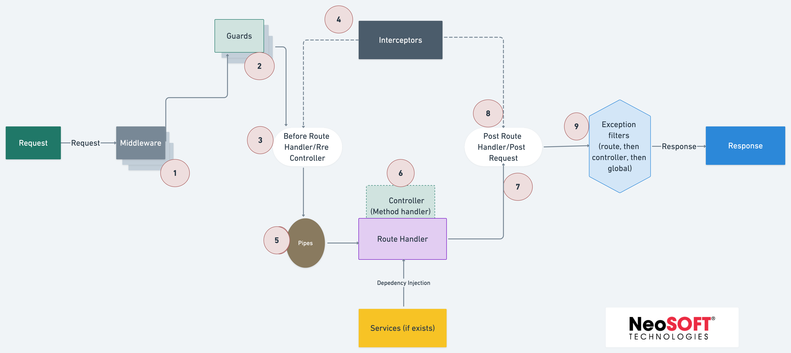

## Description

- [Nest](https://github.com/nestjs/nest) framework TypeScript starter repository.

- Nest provides a level of abstraction above these common Node.js frameworks (Express/Fastify) but also exposes their APIs directly to the developer. This allows developers the freedom to use the myriad of third-party modules which are available for the underlying platform.

- There are superb libraries, helpers, and tools that exist for Node (and server-side JavaScript), none of them effectively solve the main problem of — Architecture.

- ### Features of NestJS
    - Extensible Approach
    - Easy to use, learn and master
    - Command Line Interface(CLI)
    - Versatile
    - Progressive
    - Implemented Based on SOLID Principles
    - Lazy and Dynamic Modules
    - API Versioning
    - Documentation
    - Open Source
    - Large & Active Community
## Motivation

- With this skeleton, we can easily start a server application using Node.js, Nest JS and TypeScript.
- Rather than spending time on the project setup, get on with the important stuff right away.

Take it for a test drive. We'd love to hear any feedback you have or if you've thought of a new feature.

## Common Features

- Quick start
- Integrated ESLint, Prettier and Husky
- Common Error Handler
- Simple and Standard scaffolding
- Production-Ready Skeleton
- Followed SOLID Principles
## Getting started

Skeleton for REST API applications written in Node JS & Nest JS with TypeScript

### Prerequisites

- Node <https://nodejs.org/en/> *use the LTS version*
- NPM
- Docker <https://www.docker.com/>
    - Install Docker Desktop for MAC: [https://docs.docker.com/docker-for-mac/install/](https://docs.docker.com/docker-for-mac/install/)
    - Install Docker Desktop for Windows: [https://docs.docker.com/docker-for-windows/install/](https://docs.docker.com/docker-for-windows/install/)
- [Docker Compose](https://docs.docker.com/compose/install/)
- NestJS CLI <https://nestjs.com/>

### Create development environment

To get started, clone the repository to your local computer. Use the following command to run in your terminal.

```bash
// clone the application
$ git clone https://github.com/NeoSOFT-Technologies/rest-node-nestjs.git
```

Next, install the packages that are required for this project.

```bash
// Install the required npm modules
$ npm install
```

### Create the Environment Variables

The `.env` file should be placed in root folder with the following variables.

```
# .env.example

APP_NAME=rest_api
NODE_ENV=dev
DB_HOST=127.0.0.1
DB_NAME=rest_api
DB_USER=user
DB_PASSWORD=root
DB_PORT=3306
```

### Start MySQL Database

In order to use mysql, you need to have it installed in your local machine.
Docker Compose is what we will be using in our case, In the project directory, execute the following command.

```
# build images, create and run containers in background
docker-compose up -d
```

In order to apply your modified code to a running container, you should add a build option.

```
# if source code is changed, rebuild image, recreate and start container
docker-compose up -d --build
```

### Running the app

```bash
# development
$ npm run start

# watch mode
$ npm run start:dev

# production mode
$ npm run start:prod
```

### Test

```bash
# unit tests
$ npm run test

# e2e tests
$ npm run test:e2e

# test coverage
$ npm run test:cov
```

## Documentations

### 1. [Request and Response Cycle](wiki/modules/request-response.md)

> An explanation of how the request and response cycle works is provided here

#### 1.1 Request and Response Workflow

> Boilerplate has a custom guard enabled for handling response and request for every api. The integration of request response guard is enabled by default with response structure



#### 1.2 Request Workflow

> By creating a workflow, you can specify the template that should be used to create a change request when a request for service is logged.


### 2. Modules

- [Logger](wiki/modules/logger.md)
- [Request Response](wiki/modules/request-response.md)
- [Mailer](wiki/modules/mailer.md)
- [Database](wiki/modules/database.md)
- [Pattern](wiki/modules/pattern.md)
### 3. Miscellaneous

- [Known Issues](wiki/clean-docker.md)
- [Clean Docker Images](wiki/clean-docker.md)
- [Nest JS Roadmap for Beginners](wiki/nestjs-roadmap.png)
- [Nest JS for Beginners](wiki/nestjs.md)
- [Node JS for Beginners](wiki/nodejs.md)
- [Git commits](wiki/git-commits.md)


## Contributing to this project

Contributions are welcome from anyone and everyone. We encourage you to review the [guiding principles for contributing](CONTRIBUTING.md)

* [Bug reports](CONTRIBUTING.md#bugs)
* [Feature requests](CONTRIBUTING.md#features)
* [Pull requests](CONTRIBUTING.md#pull-requests)

### Issues/Discussions

- [Create New Issue](https://github.com/NeoSOFT-Technologies/rest-node-nestjs/issues/new)
- [Check Existing Issues](https://github.com/NeoSOFT-Technologies/rest-node-nestjs/issues)
- [Discussions](https://github.com/NeoSOFT-Technologies/rest-node-nestjs/discussions)
## Stay in touch

* Website - [https://www.neosofttech.com/](https://www.neosofttech.com/)
* Twitter - [@neosofttech](https://twitter.com/neosofttech)
* Meetup -  [https://www.meetup.com/neosoft-technologies/](https://www.meetup.com/neosoft-technologies/)
* Medium -  [https://medium.com/@neosofttech-technologies-blog](https://medium.com/@neosofttech-technologies-blog)
* GitHub - [https://github.com/NeoSOFT-Technologies](https://github.com/NeoSOFT-Technologies)

