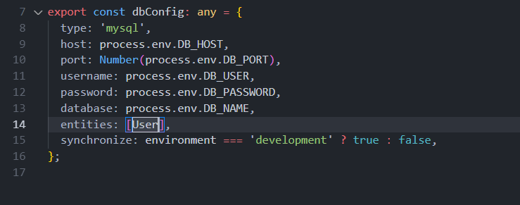

# Database

Boiler plate has already included mysql database configuration with the core modules. To leverage the functionality, we need to define the database connection in config.ts. Update the database configuration as per your setting.


> **Note:** It is a best practice to import database information from environment.




> ```entities:  ``` Entities that maps with database table.

> ```synchronize:  ``` Synchronize the entities with databases. Should not be enabled for production.


## Using other database apart from MySQL. 

The existing boiler plate comes with by default support for MySQL. This doesn't mean that you cannot use any other database like MongoDB,Postgres etc. Install the respective package of the database and update the config.ts as per required database configuration.

