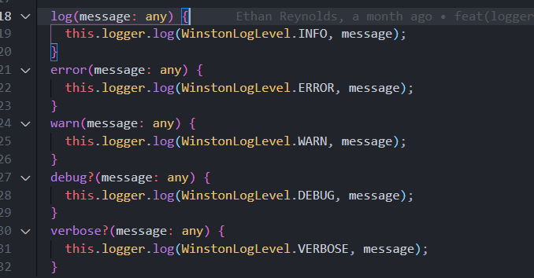

# Logger

Logger module is already present in Boiler Plate. We have used  [winston](https://www.npmjs.com/package/winston) npm package to extend the logger functionality. The objective of the logger module is 

1. It should support text-based logging 
2. Defining different levels of logs like warn, error, debug etc. 

## Usability 
Logger is part of CoreModule imports which would be default enabled for every application. To call the logger module we need to import it as dependency and then call the desired function for logging info 




Logger module has different level of functions for logging

```
constructor( private appLogger: AppLogger) {} 

this.appLogger.log('API called');
```

Logs are created in app.log file at project root level below
## Output format
```Log format would be (datetime [app_name] level: message)eg. 2021-06-15T05:45:28.894Z [Boiler plate NestJS] info: API called ```

