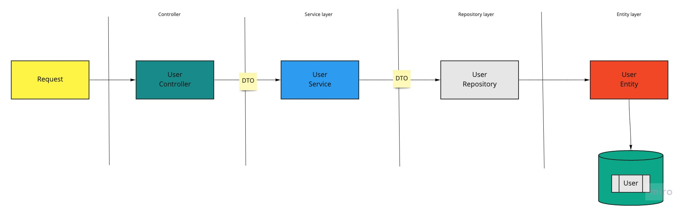

Design Pattern

## Clean architecture

> Separation of concerns at the architectural level

This document defines the design pattern for developing any web api application. We intend to follow clean architecture. Dividing the application into multiple layers like Domain layer, Service layer, Repository layer etc. The implementation of these layer would explained via example. For more understanding kindly refer Clean Architecture related articles.

In this boiler plate, we define the methods and techniques that would useful for building and maintaining web app build in NestJS. NestJS itself has covered alot techniques like TypeORM, Dependency Injection and so on. This document help us to utilize functionality and follow clean architecture.

In the above diagram, we code the see the how does the request flows from controller to database. There are lot of aspects that need to consider in this, like external api calls, caching etc which would be covered later.

### Inversion of Control (IoC)

In software engineering, inversion of control (IoC) is a programming principle. IoC inverts the flow of control as compared to traditional control flow. In IoC, custom-written portions of a computer program receive the flow of control from a generic framework. A software architecture with this design inverts control as compared to traditional procedural programming: in traditional programming, the custom code that expresses the purpose of the program calls into reusable libraries to take care of generic tasks, but with inversion of control, it is the framework that calls into the custom, or task-specific, code.

Below is the inversion of flow for the boiler plate which has been used for user module.

The control flows from UserController to UserService, we have DTO defined for transfering data between classes eg. create.user.dto, update.user.dto

## Understanding the implementation of clean code in boilerplate

To start with let's understand the folder structure and files first.

App.module — the core of the project, here we import modules that are providing functionalities.
users.module — this module will be imported by AppModule to provide everything that is related to our users.
users.controller — Here we declare our endpoints with all parameters.
entities — in this place we declare our User class.
dto— data transfer object — a bunch of interfaces for communication with the application.
repository — in this place we define all the queries related to database or external IO.
services - in this place we have our business logic defined

Now let us go through each folder

## 1. entities

In this folder, we have defined the database table fields that is required for that entity. TypeORM has some build-in helpers like PrimaryGeneratedColumn, Column etc. Ref: [TypeORM documentation](https://typeorm.io/#/entities)

## 2. dto

In this folder, we have defined the the data transfer object that would be used to communicated between classes. DTO are helpful for avoid leak of unwanted data or fields

## 3. repository

In this folder, we have defined the database queries related to the entity. We have used typeORM for fetching or saving data. Before defining the implementation of the repository, it is a good practice to define an interface of the repository.

## 4. services

In this folder, we have defined the business logic related to the entity. For executing the db queries, we use the repository. Repository and services are loosely coupled with the repository interface.
