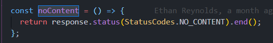
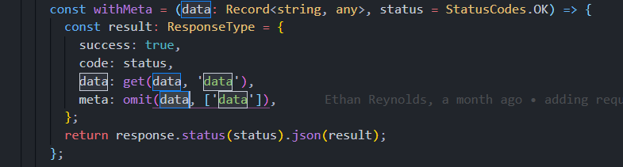

# Request Response 
  Boilerplate has a custom guard enabled for handling response and request for every api. The integration of request response guard is enabled by default with response structure

## Overview


## Available function for response.

### **success**


 The success function expected two parameters
 1) data: Json response data.
 2) Status code: API response status code, we have used [http-status-codes](https://www.npmjs.com/package/http-status-codes) enums for different type of response code.

### **error**


 The error function expected two parameters
 1) error: Json response data.
 2) Status code: API response status code, we have used [http-status-codes](https://www.npmjs.com/package/http-status-codes) enums for different type of response code.

### **noContent**



 The noContent function expected no parameters


### **withMeta**



 The withMeta function expected two parameters. This function extract additional data passed to response object into new response key as meta.
 1) data: Json response data.
 2) Status code: API response status code, we have used [http-status-codes](https://www.npmjs.com/package/http-status-codes) enums for different type of response code.

## Usability:  

We need to import the Request and Response interface from the core modules

```import { Request, Response } from '@libs/core';```
```
@Controller()
export class AppController {
  constructor(private readonly appService: AppService, private appLogger: AppLogger) {}

  @Get()
  getHello(@Req() req: Request, @Res() res: Response): Promise<Response> {
    this.appLogger.log('API called');
    return res.success(this.appService.getHello());
  }
}
```
